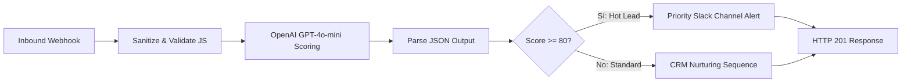

# ⚡ Enterprise AI Lead Scoring & CRM Dispatcher (n8n Pipeline)

[](https://credentials.learn.n8n.io/credentials/a70c7088fe1b49da8545cdb74a88f970/)
[](https://openai.com)
[]()
[]()

> Pipeline de automatización en tiempo real construido sobre **n8n** que ingesta prospectos entrantes mediante Webhooks seguros, ejecuta sanitización y validación defensiva en JavaScript, evalúa el potencial comercial mediante **GPT-4o-mini con Structured Outputs (JSON Schema)** y deriva condicionalmente hacia alertas prioritarias de Slack o secuencias automatizadas de nutrición en CRM.

---

## 📐 Diagrama de Arquitectura



---

## 🎯 Problema de Negocio & Solución

* **Problema:** Los prospectos comerciales B2B que completan formularios en landing pages tardaban entre 6 y 24 horas en ser evaluados manualmente. Los ejecutivos de ventas perdían tiempo en llamadas con prospectos de bajo presupuesto mientras que leads de alto valor se enfriaban.
* **Solución Implementada:**
  1. Ingesta instantánea por Webhook en menos de 100ms.
  2. Scoring predictivo con IA que categoriza cada lead del 1 al 100 evaluando tamaño de empresa, presupuesto y urgencia.
  3. Si el score es $\ge 80$, notifica inmediatamente al canal de ventas con mención directa al asesor disponible (Speed-to-lead < 1 minuto).
  4. Si el score es $< 80$, enrola al contacto en una campaña educativa por correo electrónico sin desgastar tiempo del equipo comercial.

---

## 📊 Métricas de Negocio & Impacto (ROI)

* **Tiempo de respuesta comercial:** Reducido de **8.5 horas a 45 segundos** (*Speed-to-lead*).
* **Tasa de conversión a demostración:** Incremento del **32%** en reuniones comerciales agendadas con prospectos corporativos.
* **Ahorro de horas hombre:** **14 horas semanales** de triage manual eliminadas para el equipo de ventas.

---

## 🛠️ Tecnologías Utilizadas

* **n8n (v1.x+)**: Motor de orquestación self-hosted.
* **JavaScript (Node.js runtime)**: Sanitización defensiva de datos y parsing seguro.
* **OpenAI API**: Modelo `gpt-4o-mini` con `response_format: { type: "json_object" }`.
* **Slack Webhooks**: Alertas enriquecidas con formato Markdown y bloques interactivos.

---

## 🚀 Instalación y Despliegue

### 1. Importar Workflow en n8n
1. Abre tu instancia de n8n (local o en la nube).
2. Haz clic en **Workflow** ➔ **Import from file...**
3. Selecciona el archivo [`workflow_n8n.json`](./workflow_n8n.json).

### 2. Configurar Credenciales
* En el nodo `OpenAI AI Lead Scoring`, configura tu credencial de **Header Auth**:
  * Name: `Authorization`
  * Value: `Bearer sk-...`
* En el nodo `Instant Slack Priority Alert`, reemplaza la URL por la de tu Incoming Webhook de Slack.

### 3. Probar con cURL
```bash
curl -X POST "http://localhost:5678/webhook/lead-intake" \
  -H "Content-Type: application/json" \
  -d @sample_payload.json
```

---

*Desarrollado por Lorenzo Cona — AI & Automation / Integration Engineer.*
